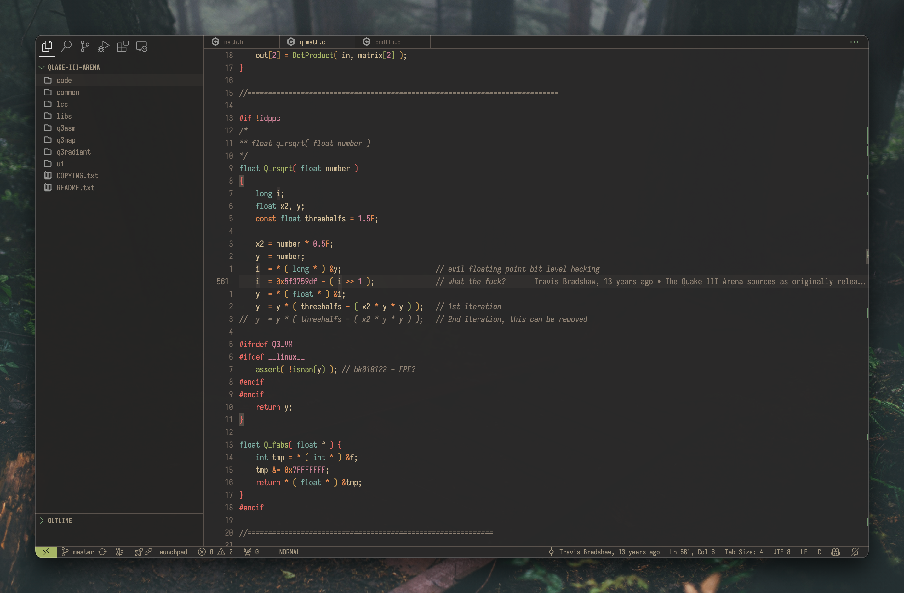
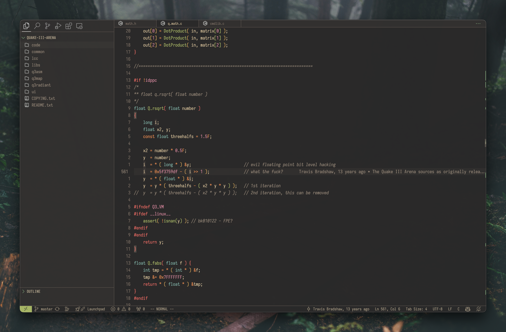

<h1 align="center">
𝐆𝐫𝐮𝐯𝐛𝐨𝐱 𝐌𝐚𝐭𝐞𝐫𝐢𝐚𝐥 Modern
</h1>

<h2 align="center">
𝐃𝐚𝐫𝐤 Medium
</h2>

<h2 align="center">
𝐃𝐚𝐫𝐤 Soft
</h2>

This color scheme is just a small adaptation of [Gruvbox Material](https://github.com/sainnhe/gruvbox-material), inspired by the modern look of [Github Theme](https://github.com/primer/github-vscode-theme)

## Information

The screenshots showed in the repository are using customizations by the [Apc Customize UI++](https://github.com/drcika/apc-extension) extension.

Here are my [configurations](https://gist.github.com/jpcrs/be97bd403e78d45a0ddf73de93513a45)

## Credits

- [@sainnhe](https://github.com/sainnhe) for creating the original Gruvbox Material palette and extension

## License

[MIT License](LICENSE)